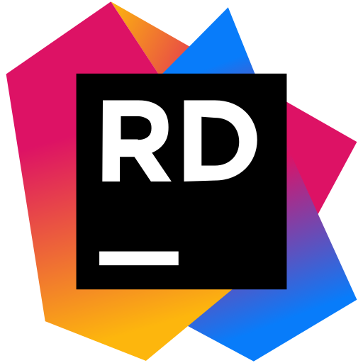



---

[English](./README.md) | **简体中文**

---

**Kook.Net** 是一个为 [KOOK（前称 开黑啦）API](https://developer.kookapp.cn/doc/intro) 提供的非官方 C# .NET SDK 实现。

---

## 源码与文档

源代码提供在 [GitHub](https://github.com/gehongyan/Kook.Net)、[Gitee](https://gitee.com/gehongyan/Kook.Net)、以及
[GitCode](https://gitcode.com/gehongyan/Kook.Net) 上。

可在 [kooknet.dev](https://kooknet.dev) 上查看文档。

也可查阅与询问 [DeepWiki (英语)](https://deepwiki.com/gehongyan/Kook.Net) 或
[OpenDeepWiki](https://opendeep.wiki/gehongyan/Kook.Net)，来寻求与源代码及文档相关的帮助。

---

## 目标框架

- [.NET 10.0](https://dotnet.microsoft.com/download/dotnet/10.0)
- [.NET 9.0](https://dotnet.microsoft.com/download/dotnet/9.0)
- [.NET 8.0](https://dotnet.microsoft.com/download/dotnet/8.0)
- [.NET Standard 2.1](https://learn.microsoft.com/dotnet/standard/net-standard?tabs=net-standard-2-1)
- [.NET Standard 2.0](https://learn.microsoft.com/dotnet/standard/net-standard?tabs=net-standard-2-0)
- [.NET Framework 4.6.2](https://dotnet.microsoft.com/download/dotnet-framework/net462)

> [!TIP]
> .NET 10 之外的目标框架尚未完全测试。

---

## 安装

### 主程序包

主程序包可以提供所有官方 API 的实现。

- Kook.Net: [NuGet](https://www.nuget.org/packages/Kook.Net/), [GitHub Packages](https://github.com/gehongyan/Kook.Net/pkgs/nuget/Kook.Net)

### 独立程序包

主程序包的各个组件可以单独安装，这些程序包包含在主程序包中。

- Kook.Net.Core: [NuGet](https://www.nuget.org/packages/Kook.Net.Core/),
  [GitHub Packages](https://github.com/gehongyan/Kook.Net/pkgs/nuget/Kook.Net.Core)
- Kook.Net.Rest: [NuGet](https://www.nuget.org/packages/Kook.Net.Rest/),
  [GitHub Packages](https://github.com/gehongyan/Kook.Net/pkgs/nuget/Kook.Net.Rest)
- Kook.Net.WebSocket: [NuGet](https://www.nuget.org/packages/Kook.Net.WebSocket/),
  [GitHub Packages](https://github.com/gehongyan/Kook.Net/pkgs/nuget/Kook.Net.WebSocket)
- Kook.Net.Webhook: [NuGet](https://www.nuget.org/packages/Kook.Net.Webhook/),
  [GitHub Packages](https://github.com/gehongyan/Kook.Net/pkgs/nuget/Kook.Net.Webhook)
- Kook.Net.Pipe: [NuGet](https://www.nuget.org/packages/Kook.Net.Pipe/),
  [GitHub Packages](https://github.com/gehongyan/Kook.Net/pkgs/nuget/Kook.Net.Pipe)
- Kook.Net.Commands: [NuGet](https://www.nuget.org/packages/Kook.Net.Commands/),
  [GitHub Packages](https://github.com/gehongyan/Kook.Net/pkgs/nuget/Kook.Net.Commands)

### 扩展程序包

扩展程序包提供了主程序包中未包含的其他功能或实现。

- Kook.Net.CardMarkup: [NuGet](https://www.nuget.org/packages/Kook.Net.CardMarkup/),
  [GitHub Packages](https://github.com/gehongyan/Kook.Net/pkgs/nuget/Kook.Net.CardMarkup)
- Kook.Net.Webhook.AspNet: [NuGet](https://www.nuget.org/packages/Kook.Net.Webhook.AspNet/),
  [GitHub Packages](https://github.com/gehongyan/Kook.Net/pkgs/nuget/Kook.Net.Webhook.AspNet)
- Kook.Net.Webhook.HttpListener: [NuGet](https://www.nuget.org/packages/Kook.Net.Webhook.HttpListener/),
  [GitHub Packages](https://github.com/gehongyan/Kook.Net/pkgs/nuget/Kook.Net.Webhook.HttpListener)
- Kook.Net.MessageQueue.InMemory: [NuGet](https://www.nuget.org/packages/Kook.Net.MessageQueue.InMemory/),
  [GitHub Packages](https://github.com/gehongyan/Kook.Net/pkgs/nuget/Kook.Net.MessageQueue.InMemory/)
- Kook.Net.MessageQueue.MassTransit: [NuGet](https://www.nuget.org/packages/Kook.Net.MessageQueue.MassTransit/),
  [GitHub Packages](https://github.com/gehongyan/Kook.Net/pkgs/nuget/Kook.Net.MessageQueue.MassTransit/)
- Kook.Net.DependencyInjection.Microsoft: [NuGet](https://www.nuget.org/packages/Kook.Net.DependencyInjection.Microsoft/),
  [GitHub Packages](https://github.com/gehongyan/Kook.Net/pkgs/nuget/Kook.Net.DependencyInjection.Microsoft/)
- Kook.Net.Hosting: [NuGet](https://www.nuget.org/packages/Kook.Net.Hosting/),
  [GitHub Packages](https://github.com/gehongyan/Kook.Net/pkgs/nuget/Kook.Net.Hosting/)

### 实验性程序包

实验性程序包提供了尚未正式发布或文档化的 API 的实现。它们可能违反开发者规则或政策，缺乏稳定性保证，并且可能在未来发生更改或删除。

- Kook.Net.Experimental: [NuGet](https://www.nuget.org/packages/Kook.Net.Experimental/),
  [GitHub Packages](https://github.com/gehongyan/Kook.Net/pkgs/nuget/Kook.Net.Experimental)

---

## 许可证与版权

此程序包是开源的，根据 [MIT 许可证](LICENSE) 授权。

Kook.Net 参考了 **[Discord.Net](https://github.com/discord-net/Discord.Net)** 进行开发，本仓库中的部分代码版权归
[Discord.Net 贡献者](https://github.com/discord-net/Discord.Net/graphs/contributors) 所有，根据
[此许可证](https://github.com/discord-net/Discord.Net/blob/dev/LICENSE) 进行授权。

---

## 致谢

特别感谢 [Discord.Net](https://github.com/discord-net/Discord.Net) 项目，感谢他们开发了如此优秀的项目。

  
  

特别感谢 [JetBrains](https://www.jetbrains.com) 提供的免费许可证，使我们能使用他们出色的工具 -
[Rider](https://www.jetbrains.com/rider/) and [ReSharper](https://www.jetbrains.com/resharper/) -
来开发 Kook.Net。
