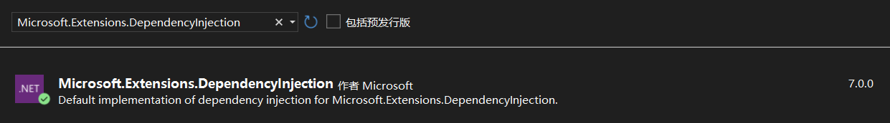
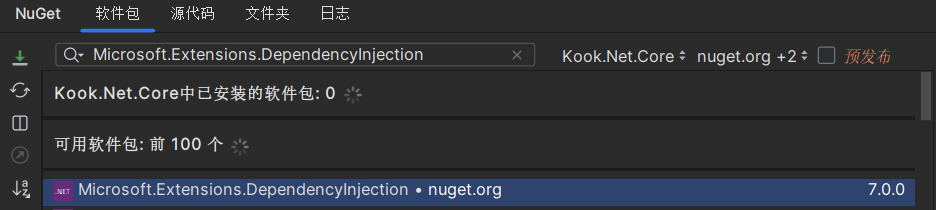

# 依赖注入

依赖注入并不是 Discord.Net 中必要的功能，但它可以让框架的使用更为简便。与许多其他库相结合使用，可以更好地控制应用程序。

## 按照

依赖注入不是 .NET 的原生功能。您需要将扩展包安装到项目中才能使用它：

- [Microsoft.Extensions.DependencyInjection](https://www.nuget.org/packages/Microsoft.Extensions.DependencyInjection/)
- [Microsoft.Extensions.DependencyInjection.Abstractions](https://www.nuget.org/packages/Microsoft.Extensions.DependencyInjection.Abstractions/)

> [!WARNING]
> 仅下载 Abstractions 包不包含使用依赖注入所需的一些必要类，请确保同时安装两个包，或选择仅安装
> Microsoft.Extensions.DependencyInjection 包来隐式同时安装两个包。

### Visual Studio



- 程序包管理控制台

    `PM> Install-Package Microsoft.Extensions.DependencyInjection`.

### Rider



### 命令行

```sh
dotnet add package Microsoft.Extensions.DependencyInjection
```

> [!TIP]
> ASP.NET 已经在其框架中包含了所有必要的程序集，要在 ASP.NET 中使用依赖注入完整功能，不需要安装任何额外的 NuGet 包。

## 开始

首先，您需要创建一个基于依赖注入的应用程序，这样就可以在整个项目中访问并注入它们。

[!code-csharp[Building the Program](samples/program.cs)]

要在不同的类中自由传递依赖项，您需要将它们注册到新的 `ServiceCollection` 中，并将它们构建到 `IServiceProvider` 中，如上所示。
然后需要通过启动文件访问 IServiceProvider，以便您可以访问您的提供程序并对其进行管理。

[!code-csharp[Building the Collection](samples/collection.cs)]

如上所示，这里创建了一个 `KookSocketConfig` 的实例，并在添加客户端本身**之前**将其添加到了服务容器中。
服务容器会优先选择已经存在的服务来填充构造函数，且你已经将配置类注册到服务容器中，因此，带有配置参数的构造函数重载会被优先调用。

## 使用依赖项

在 Program 类的构造函数中构建服务容器提供程序后，现在可以在您正在使用的实例中使用它了。
通过提供程序，我们可以请求我们之前所注册的 KookSocketClient。

[!code-csharp[Applying DI in RunAsync](samples/runasync.cs)]

> [!WARNING]
> 服务实例的构造函数在被**首次请求**之前不会被调用。要想实例化服务容器里的服务，需要先从提供程序中请求服务。
> 如果所请求的服务有依赖项，那么在实例化服务本身之前，其未被实例化的依赖项会被实例化。

## 注入依赖项

您不仅可以直接从字段或属性中访问提供程序，还可以将实例传递给在提供程序中注册的类。有多种方法可以实现这一点。请参考
[注入实例](xref:Guides.DI.Injection) 了解更多信息。
