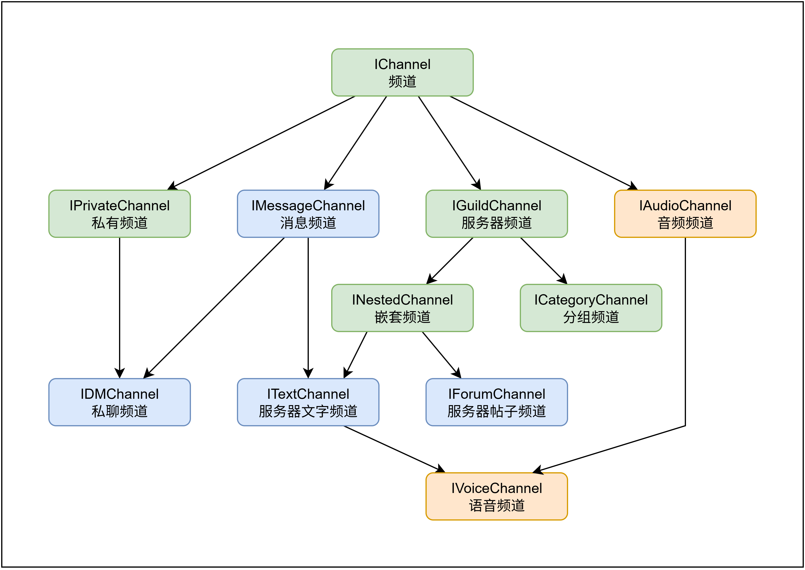
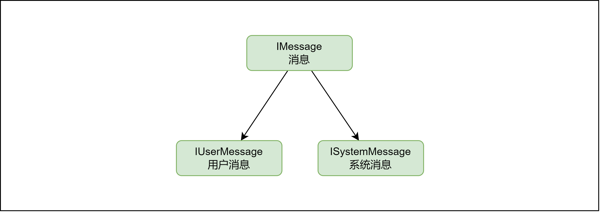
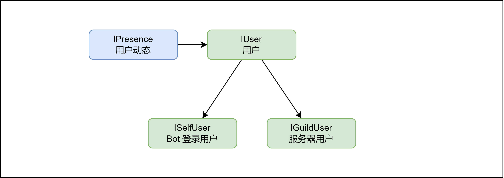

# 实体类型

所有 Kook.Net 实体的列表及其之间的继承关系，来表示哪些类型之间可以进行相互转换。

> [!NOTE]
> Socket 和 Rest 实体的所有接口都具有相同的继承树，其中，图中被标记为红色的实体是其所在工程所独有的。

## 频道 [IChannel]

### 消息频道

* **服务器文字频道** ([ITextChannel])：服务器内的消息频道
* **私聊频道** ([IDMChannel])：私信聊天会话频道
    - Kook.Net 中的私信聊天会话也被抽象为一个频道
* **私有频道** ([IPrivateChannel])：非服务器内的消息频道
    - 由于 KOOK 暂不支持讨论组，所以目前私有频道也只有私聊频道
* **消息频道** ([IMessageChannel])：可以发送文字消息的频道

### 其它频道

* **服务器频道** ([IGuildChannel])：服务器内的频道
    - 这可以是能出现在服务器内的任何一种频道类型
* **音频频道** ([IAudioChannel])：音频频道
* **语音频道** ([IVoiceChannel])：服务器内的语音频道
* **分组频道** ([ICategoryChannel])：服务器内的分组频道，可以包含多个子频道
* **嵌套频道** ([INestedChannel])：可以出现在分组频道下的频道

[INestedChannel]: xref:Kook.INestedChannel

[IGuildChannel]: xref:Kook.IGuildChannel

[IMessageChannel]: xref:Kook.IMessageChannel

[ITextChannel]: xref:Kook.ITextChannel

[IDMChannel]: xref:Kook.IDMChannel

[IPrivateChannel]: xref:Kook.IPrivateChannel

[IAudioChannel]: xref:Kook.IAudioChannel

[IVoiceChannel]: xref:Kook.IVoiceChannel

[ICategoryChannel]: xref:Kook.ICategoryChannel

[IChannel]: xref:Kook.IChannel

## 消息 [IMessage]

* **用户消息** ([IUserMessage])：用户所发送的消息
* **系统消息** ([ISystemMessage])：KOOK 系统用户发送的消息
* **消息** ([IMessage])：所有消息的基本类型接口

[IUserMessage]: xref:Kook.IUserMessage

[ISystemMessage]: xref:Kook.ISystemMessage

[IMessage]: xref:Kook.IMessage

## 用户 [IUser]

* **用户状态** ([IPresence])：用户的状态信息
* **服务器用户** ([IGuildUser])：服务器内的用户
* **Bot 登录用户** ([ISelfUser])：当前客户端登录到 KOOK 的机器人用户
* **用户** ([IUser])：所有用户的基本类型接口

[IPresence]: xref:Kook.IPresence

[IGuildUser]: xref:Kook.IGuildUser

[ISelfUser]: xref:Kook.ISelfUser

[IUser]: xref:Kook.IUser

## 其它类型

### 表情符号 [IEmote]

* **Emote** ([Emote])：服务器内创建的自定义表情
    - Example: `(emj)kaiheila-logo(emj)[1990044438283387/8BZCdG49cL069069]`
* **Emoji** ([Emoji])：Unicode 表示的 Emoji 表情符号
    - Example: `👍`

[Emote]: xref:Kook.Emote

[Emoji]: xref:Kook.Emoji

[IEmote]: xref:Kook.IEmote

### 用户动态 [IActivity]

* **游戏** ([IGame])：代表用户的游戏活动

[IGame]: xref:Kook.IGame

[IActivity]: xref:Kook.IActivity
