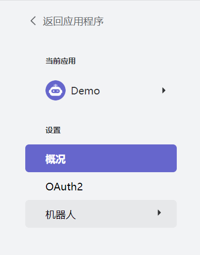
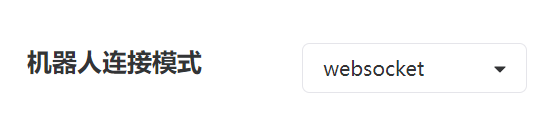
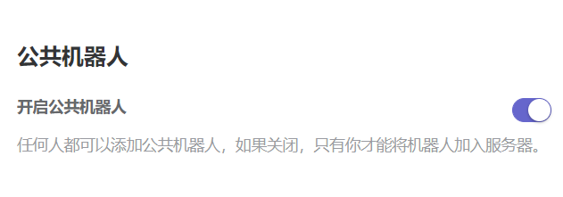
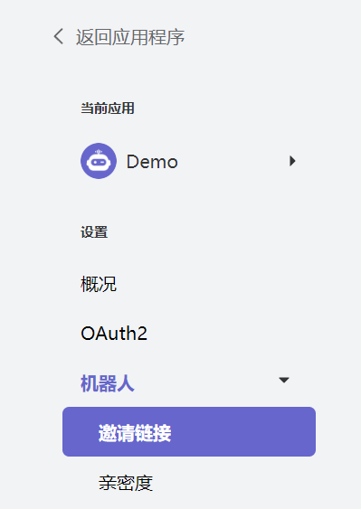
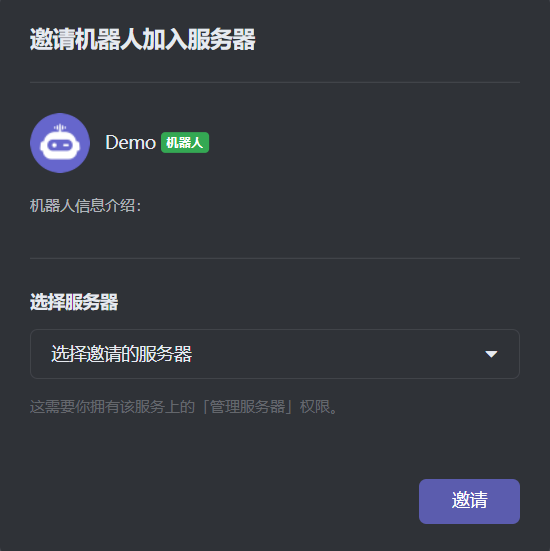

# 使用 KaiHeiLa.Net 构建你的第一个 Bot

本指南将引导您使用 KaiHeiLa.Net 构建一个简单的 Bot。在此之前，请先确保您已参与开黑啦开发者，并获得开发权限。

## 创建一个开黑啦应用

在开始编写代码前，您需要通过开黑啦开发者中心创建一个 Bot。

1. 访问并登录到 [开黑啦开发者中心](https://developer.kaiheila.cn/app/index)；
2. 点击 `新建应用`；
3. 填写应用名称；
4. 点击刚刚创建好的应用；
5. 点击左侧的 `机器人`；

    

6. 确保机器人的连接模式为 `WebSocket`；

    

7. (可选) 如果要创建公共 Bot，开启 `开启公共机器人` 开关。

    

## 将 Bot 添加到服务器

Bot 无法通过访问服务器的邀请链接进入频道，因此需要 Bot 的邀请链接将 Bot 添加到服务器。

1. 在 [开黑啦开发者中心](https://developer.kaiheila.cn/bot) 中访问要添加到服务器的 Bot 应用；
2. 点击左侧的 `邀请链接`；

    

3. 在右侧的 `角色权限设置` 中勾选要在 Bot 进入服务器后直接拥有的权限；
    
   > [!NOTE]
   > 这将会在服务器内创建一个仅可授予给该 Bot 的托管角色，该 Bot 将会在进入服务器后自动获得该角色。
   > 如需在进入服务器后变更权限，可通过 `服务器设置` 中的 `角色权限` 进行修改。

4. 打开上方生成的邀请链接；
5. 选择要将 Bot 添加到的服务器；
6. 点击邀请。

    

   > [!NOTE]
   > 列表中仅显示您拥有 `管理服务器` 权限的服务器。

## 将 Bot 连接至开黑啦

如果您已创建工程，并安装了 KaiHeiLa.Net，可参考以下步骤，
否则，请参考 @Guides.GettingStarted.Installation 。

### 异步启动

KaiHeiLa.Net 广泛采用 .NET 的 [异步编程模型]，绝大多数操作都是以异步方式完成，
请尽可能地在异步上下文中等待这些操作。

可以通过这样的方式创建异步的入口点函数，来建立一个在异步上下文中启动的程序：

[!code-csharp[Async Main](samples/async-main.cs)]

> [!WARNING]
> 应用程序中异步上下文抛出的任何异常都会被持续向上层抛出直到首个同步方法，
> 由于该程序的首个同步方法是程序的入口点函数 `Main`，
> **所有**未经处理的异常都会被抛出到这里，这将导致程序退出。
> 
> KaiHeiLa.Net 会阻止事件处理函数中发生的异常，以避免该异常导致程序退出，
> 但 `MainAsync` 中的任何其它未经处理的异常仍然会导致程序退出。

[异步编程模型]: https://docs.microsoft.com/zh-cn/dotnet/csharp/async

### 创建日志方法

在创建并配置开黑啦 Bot 客户端程序前，我们需要创建一个事件处理程序来订阅 KaiHeiLa.Net 的日志事件。

为了尽可能地广泛支持各种日志提供程序，KaiHeiLa.Net 通过 `Log` 事件来记录日志信息，
其事件参数为 `LogMessage`。有关该事件地详细信息，可参考 [API 文档]。

如需要使用自己的日志记录框架，请在此该事件行调用。此处，为了简单起见，我们仅将日志记录到控制台中。

[!code-csharp[Simple Logging](samples/simple-logging.cs)]

[API 文档]: xref:KaiHeila.Rest.BaseKaiHeilaClient.Log

### 创建开黑啦 Bot 客户端程序

为了编写一个能与开黑啦服务端实时互动的 Bot，请使用 [KaiHeiLaSocketClient] 作为客户端，
使用 Socket 实体，如您不了解 KaiHeiLa.Net 的多种实现，请参考 @Guides.GettingStarted.Terminology 。
在异步入口点中创建一个 [KaiHeiLaSocketClient] 的实例，用于与开黑啦服务端建立连接，
如有需要，也可向构造函数中传递一个 @KaiHeiLa.WebSocket.KaiHeiLaSocketConfig 的可选参数，
多数情况下，默认值即可。

在连接前，将刚刚创建的日志事件处理程序订阅到客户端的 `Log` 事件中。
KaiHeiLa.Net 中的事件与 C# 中的任何其他事件的工作机制类似。

使用 [LoginAsync] 方法登录到开黑啦服务端，登录过程采用的身份认证信息为机器人的 Token。

通过调用客户端的 [StartAsync] 方法，客户端启动与服务端的连接/重连机制，
**该方法会在连接/重连机制启动后立刻返回**，因此，任何依赖于客户端状态的方法
都应以事件处理程序的形式执行。

为了阻止程序在运行期间的异步入口点返回，请在 `MainAsync` 方法退出前等待一个无限时长的延迟，
获取其它可以阻止程序继续运行的方法，例如，等待控制台中输入信息。

> [!IMPORTANT]
> Token 可允许您获得对 Bot 的所有访问权限，因此，**不要**与任何无关人员共享 Token！
> 如您要公开 Bot 的源代码，请将该 Token 存储在外部源中。
> 
> 在下面的示例中，我们从预定义的变量中获取变量，这是**极其不安全**的，
> 尤其是在有计划将应用程序以任何形式发布的情况下。
> 
> 为了能够安全地处理该机密信息，建议以 [环境变量]、[配置文件]、[机密管理] 等形式存储 Token。
>
> [环境变量]: https://docs.microsoft.com/zh-cn/dotnet/api/system.environment.getenvironmentvariable?view=net-6.0
> [配置文件]: https://docs.microsoft.com/zh-cn/dotnet/core/extensions/configuration
> [机密管理]: https://docs.microsoft.com/zh-cn/aspnet/core/security/app-secrets?view=aspnetcore-6.0&tabs=linux

[!code-csharp[Create Client](samples/bot-client.cs)]

到这里，客户端应该可以连接到开黑啦服务端，运行程序，等待片刻，应该可以在开黑啦客户端中看到 Bot 上线。

> [!NOTE]
> 如需查看完整代码示例，可访问 [完整代码示例]。

[KaiHeiLaSocketClient]: xref:KaiHeiLa.WebSocket.KaiHeiLaSocketClient
[LoginAsync]: xref:KaiHeiLa.Rest.BaseKaiHeiLaClient.LoginAsync*
[StartAsync]: xref:KaiHeiLa.WebSocket.KaiHeiLaSocketClient.StartAsync*
[完整代码示例]: samples/simple-bot.cs