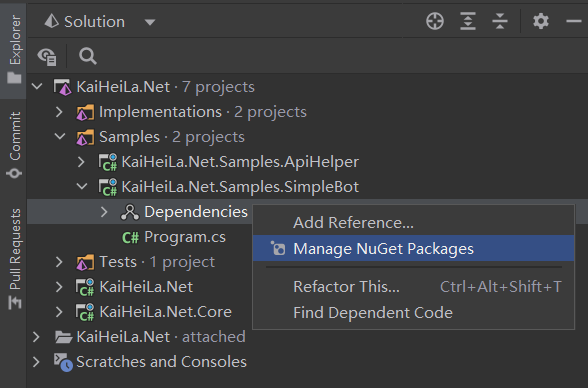

# 安装 KaiHeiLa.Net

KaiHeiLa.Net 通过 NuGet 分发，推荐通过 NuGet 包管理工具安装，
如可有需要，也可从源代码进行编译。

## 支持的平台

KaiHeiLa.Net 目前仅支持 [.NET 6.0]，版本稳定后将会扩展到较旧的平台。

[.NET 6.0]: https://docs.microsoft.com/en-us/dotnet/core/whats-new/dotnet-6

## 通过 NuGet 包管理器安装

支持的 NuGet 源有：

- [NuGet Gallery](https://nuget.org)
- [GitHub Packages](https://github.com/gehongyan?tab=packages&repo_name=KaiHeiLa.Net)

### 通过 Visual Studio

1. 找到 `解决方案资源管理器` 窗口，在 Bot 项目下找到 `依赖项`
2. 右键点击 `依赖项`，选择 `管理 NuGet 程序包`

    

3. 在 `浏览` 选项卡中，搜索 `KaiHeiLa.Net`

    > [!NOTE]
    > 在正式版发布前，搜索 KaiHeiLa.Net 需勾选 `包括预发行版`，否则，该搜索结果无法展示在列表中。

    

4. 选择 `KaiHeiLa.Net`，点击 `安装`

### 通过 JetBrains Rider

1. 找到 `Explorer` 窗口，在 Bot 项目下找到 `Dependencies`
2. 右键点击 `Dependencies`，选择 `Manage NuGet Packages`

    

3. 在 `Packages` 选项卡中，搜索 `KaiHeiLa.Net`

    > [!NOTE]
    > 在正式版发布前，搜索 KaiHeiLa.Net 需勾选 `Prerelease` ，否则，该搜索结果无法展示在列表中。

4. 右键点击 `KaiHeiLa.Net`，点击 `Install KaiHeiLa.Net ...`

    

### 使用 Visual Studio Code

1. 找到 Bot 项目的 `*.csproj` 文件
2. 添加 `Discord.Net` 到 `*.csproj` 中

    [!code[SampleProject.csproj](samples/project.xml)]

### 使用 dotnet CLI

1. 启动终端
2. 导航至 Bot 项目中 `*.csproj` 文件的所在目录
3. 执行 `dotnet add package KaiHeiLa.Net`

    > [!NOTE]
    > 在正式版发布前，通过 dotnet CLI 添加 KaiHeiLa.Net 需附加 `--prerelease` 选项，
    > 否则，dotnet CLI 将只尝试为项目添加稳定版本的 NuGet 包。

---

## 从源代码编译

要从源代码编译 KaiHeiLa.Net，请参考：

### 使用 Visual Studio

- [Visual Studio 2022](https://visualstudio.microsoft.com/zh-hans/vs/) 或更新版本。
- [.NET 6 SDK]

安装 Visual Studio 期间需选择 .NET 6 工作负载。

### 使用 JetBrains Rider

- [JetBrains 2021.3](https://www.jetbrains.com.cn/rider/) 或更新版本。
- [.NET 6 SDK]

### 使用 Command Line

* [.NET 6 SDK]

---

[.NET 6 SDK]: https://dotnet.microsoft.com/download