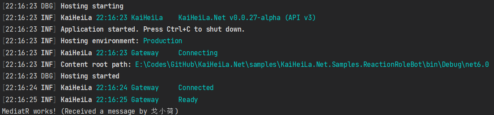

# 中介者模式 MediatR

## 先决条件

- 配置好依赖注入服务的 Bot 客户端程序

## 安装所需类库

可通过集成开发环境的用户界面或 dotnet CLI 安装以下类库：

| 名称                                                 | 链接                                                                                      |
|----------------------------------------------------|-----------------------------------------------------------------------------------------|
| `MediatR`                                          | [链接](https://www.nuget.org/packages/MediatR)                                            |
| `MediatR.Extensions.Microsoft.DependencyInjection` | [链接](https://www.nuget.org/packages/MediatR.Extensions.Microsoft.DependencyInjection) |

## 将 MediatR 添加到依赖注入服务容器中

`MediatR.Extensions.Microsoft.DependencyInjection` 提供了方法 `.AddMediatR()` 允许您以将
MediatR 便捷地添加到依赖注入服务容器中，其参数可以是事件处理程序中将会用到地任何类型，代码示例片段如下：

[!code-csharp[Configuring MediatR](samples/mediatr/configuring-di.cs)]

## 创建消息通知

MediatR 基于消息通知和其处理程序传递事件。下面的示例创建了一个消息通知来处理 `KookSocketClient`
中的 `MessageReceived` 事件。

[!code-csharp[Creating a notification](samples/mediatr/notification-demo.cs)]

## 创建事件发布者与订阅者

在 MediatR 中，事件发布者所发布的事件需要通过订阅者的监听来使用，下面的示例创建了一个事件订阅者来监听
`KookSocketClient` 中的 `MessageReceived` 事件：

[!code-csharp[Creating an event listener](samples/mediatr/event-listener.cs)]

此示例代码中，`KookEventListener` 首先从依赖注入服务中接收 `KookSocketClient`
实例用于订阅事件，本示例仅演示了 `MessageReceived`，其他事件也可以使用同样的方式，
但事件处理程序使用了 MediatR 将事件发布到所有监听此事件的的消息通知处理程序。

## 添加事件订阅者添加到依赖注入服务容器中

要开始监听事件，需在入口点函数内调用 `KookEventListener` 类的 `StartAsync()` 
方法，在此之前，需在依赖注入容器中注册 `KookEventListener` 类，并在入口点函数中获取对它的引用。

[!code-csharp[Starting the event listener](samples/mediatr/start-listener.cs)]

## 创建消息通知处理程序

MediatR 将消息通知发布到所有监听此消息通知的事件订阅者，下面的示例创建了一个消息通知处理程序：

[!code-csharp[Creating an event listener](samples/mediatr/event-handler.cs)]

此示例代码实现了 MediatR 提供的 `INotificationHandler<>` 接口，这告知了 MediatR 需要将
`MessageReceivedNotification` 通知发送到此消息通知处理程序类。

> [!NOTE]
> 您可根据需要为同一消息通知创建任意数量的消息通知处理程序。

## 测试

要测试 MediatR 是否正常工作，可以启动此 Bot 客户端，并在 KOOK 客户端中向此 Bot
可访问的文字频道内发送消息，应该能看到之前在 `MessageReceivedHandler` 中定义的输出信息：

## 添加更多的事件类型

要添加更多的事件类型，可遵循以下步骤：

1. 为事件创建消息通知类，其应包含该事件所传递的所有参数（例如：`MessageReceived`
   事件接收一个 `SocketMessage` 对象作为参数，则消息通知类也应该映射此参数）
2. 将此事件注册到 `KookEventListener` 类
3. 创建消息通知处理程序来处理此消息通知
