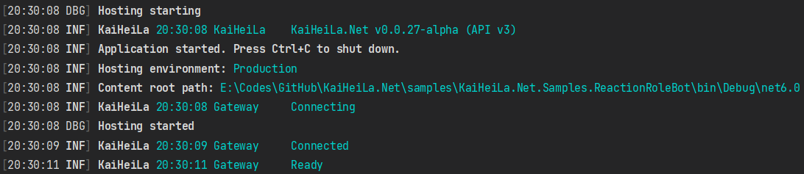

# 日志框架 Serilog

## 先决条件

- 如 [使用 Kook.Net 构建你的第一个 Bot](xref:Guides.GettingStarted.FirstBot) 中所描述的带有日志处理方法的 Bot 客户端程序。

## 安装 Serilog 类库

可通过集成开发环境的用户界面或 dotnet CLI 安装以下类库：

|名称|链接|
|--|--|
|`Serilog.Extensions.Logging`| [链接](https://www.nuget.org/packages/Serilog.Extensions.Logging)|
|`Serilog.Sinks.Console`| [链接](https://www.nuget.org/packages/Serilog.Sinks.Console)|

## 配置 Serilog

Serilog 需在异步函数入口点的顶部进行配置：

[!code-csharp[Configuring serilog](samples/serilog/configuration.cs)]

## 修改日志方法

要想让 Serilog 能够正确地记录 KOOK 的日志，需要将 Kook.Net 的 `LogSeverity`
映射到 Serilog 的 `LogEventLevel`，映射的示例如下：

[!code-csharp[MappingLogLevel](samples/serilog/mapping.cs)]

## 测试

如果现在运行程序，应该会看到以下输出：

## 在其它位置使用此日志记录器

至此，Serilog 已配置完毕，要想使用此日志记录器，只需按如下方式调用：

Now that you have set up Serilog, you can use it everywhere in your application by simply calling

[!code-csharp[Log debug sample](samples/serilog/log-debug-sample.cs)]

> [!NOTE]
> 根据所配置的日志级别，部分日志消息可能不会输出。有关日志级别的更多信息，请参见
> [Serilog 文档](https://github.com/serilog/serilog/wiki/Configuration-Basics#minimum-level)。

> [!NOTE]
> Kook.Net 与 Serilog 对日志级别的定义不完全一致，要简化最低输出日志级别控制，有两种可选策略：
>
> * 将 Serilog 的 `MinimumLevel` 配置为 `Verbose`，转而在 Kook.Net 的 `KookConfig` 中配置 `LogLevel`
> * 在 Kook.Net 的 `KookConfig` 中配置 `LogLevel` 为 `Debug`，转而在 Serilog 中配置 `MinimumLevel`
>
> 同时配置两侧的最低日志级别可能会导致预期之外的最低日志级别控制结果。
